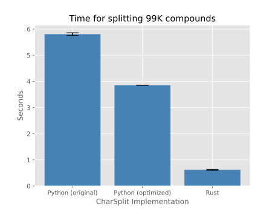

# charsplitrs

Improved Rust implementation of Don Tuggener's [CharSplit](https://github.com/dtuggener/CharSplit) for splitting German compounds. So far without the training code. 

I like the elegance and simplicity of the algorithm and found it to work very well in practice when combined with a simple dictionary lookup (e.g., via Hunspell) and a stopword list.

## Usage

Add the dependency in your `Cargo.toml`.

```toml
[dependencies]
charsplitrs = { git = "https://github.com/kldtz/charsplitrs.git" }
```

Read your ngram probabilities (or the probabilities included in the original package, see `data/ngram_probs.json`), and start splitting.

```rust
use charsplitrs::CharSplitter;

let splitter = CharSplitter::new("data/ngram_probs.json").unwrap();
    
let (left, right) = splitter.split("Haustür");
assert_eq!(left, "Haus");
assert_eq!(right, "tür");
```

## Running the GermaNet evaluation

Clone the repo, copy the GermaNet compounds file, compile and run the release binary.

```bash
git clone https://github.com/kldtz/charsplitrs.git
cd charsplitrs
wget -P data http://www.sfs.uni-tuebingen.de/GermaNet/documents/compounds/split_compounds_from_GermaNet15.0.txt
cargo run --release
```

## Performance

The [original implementation](https://github.com/dtuggener/CharSplit) can be optimized by [removing some unnecessary iterations](https://github.com/kldtz/CharSplit) without changing the results. A simple translation of this optimized version into Rust (this repo) yields another speedup.



This is not a super serious benchmark. I just ran each version five times on the GermaNet evaluation data v15.0 and averaged the execution times (without loading the JSON). The error bars represent the standard deviation.
